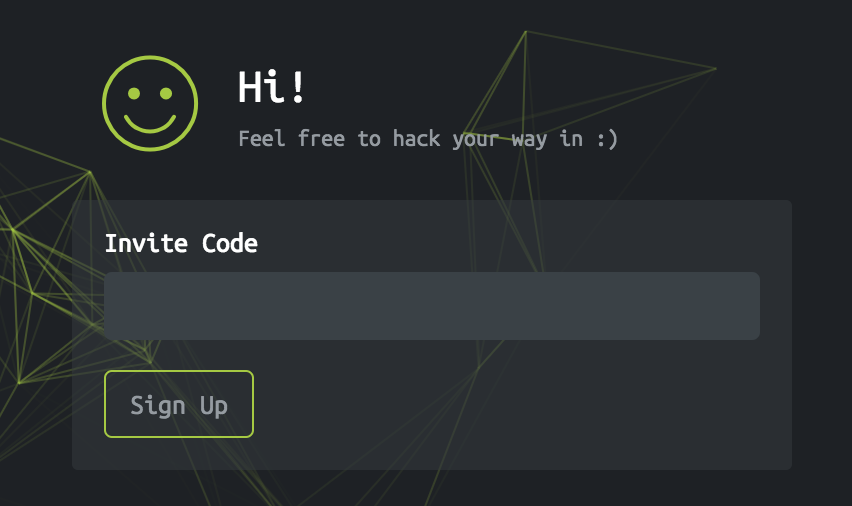

# Hack The Box Invite Code 



# Solution:

Note: I made a simple python script to get an invite code from Hack The Box website, but if you still want to know the long process kindly read the steps below. :)

1. Go to this link: https://www.hackthebox.eu/invite

2. View the Source Code and look for `/js/inviteapi.min.js` then open the JS file in another tab.

3. You should get this code:

```javascript
eval(function(p,a,c,k,e,d){e=function(c){return c.toString(36)};if(!''.replace(/^/,String)){while(c--){d[c.toString(a)]=k[c]||c.toString(a)}k=[function(e){return d[e]}];e=function(){return'\\w+'};c=1};while(c--){if(k[c]){p=p.replace(new RegExp('\\b'+e(c)+'\\b','g'),k[c])}}return p}('1 i(4){h 8={"4":4};$.9({a:"7",5:"6",g:8,b:\'/d/e/n\',c:1(0){3.2(0)},f:1(0){3.2(0)}})}1 j(){$.9({a:"7",5:"6",b:\'/d/e/k/l/m\',c:1(0){3.2(0)},f:1(0){3.2(0)}})}',24,24,'response|function|log|console|code|dataType|json|POST|formData|ajax|type|url|success|api|invite|error|data|var|verifyInviteCode|makeInviteCode|how|to|generate|verify'.split('|'),0,{}))
```

4. Let's use this website (https://beautifier.io/) to beautify this javascript:

```javascript
function verifyInviteCode(code) {
    var formData = {
        "code": code
    };
    $.ajax({
        type: "POST",
        dataType: "json",
        data: formData,
        url: '/api/invite/verify',
        success: function(response) {
            console.log(response)
        },
        error: function(response) {
            console.log(response)
        }
    })
}

function makeInviteCode() {
    $.ajax({
        type: "POST",
        dataType: "json",
        url: '/api/invite/how/to/generate',
        success: function(response) {
            console.log(response)
        },
        error: function(response) {
            console.log(response)
        }
    })
}
```

5. Now look at `makeInviteCode()` function, it calls the `/api/invite/how/to/generate' endpoint. So I created a simple cURL command to get the response from that API endpoint.

```curl
curl -i -s -k  -X $'POST' \
    -H $'Host: www.hackthebox.eu' -H $'Cookie: hackthebox_session={SESSION HERE}' \
    -b $'hackthebox_session={SESSION HERE}' \
    $'https://www.hackthebox.eu/api/invite/how/to/generate'
```

API Response:
```json
{
  "0": 200,
  "success": 1,
  "data": {
    "data": "SW4gb3JkZXIgdG8gZ2VuZXJhdGUgdGhlIGludml0ZSBjb2RlLCBtYWtlIGEgUE9TVCByZXF1ZXN0IHRvIC9hcGkvaW52aXRlL2dlbmVyYXRl",
    "enctype": "BASE64"
  }
}
```

6. Decoding the Base64 above, gives us this hint:
`In order to generate the invite code, make a POST request to /api/invite/generate`

7. I created another cURL command with POST request to `/api/invite/generate` to get the response from the API endoint.
```curl
curl -i -s -k  -X $'POST' \
    -H $'Host: www.hackthebox.eu' -H $'Cookie: hackthebox_session={SESSION HERE}' \
    -b $'hackthebox_session={SESSION HERE}' \
    $'https://www.hackthebox.eu/api/invite/generate'
```

API Response:
```json
{
  "0": 200,
  "success": 1,
  "data": {
    "code": "Rk5GUU4tUFdJSlQtUVNPVUgtWUNPWEgtTVRGS0M=",
    "format": "encoded"
  }
}
```

8. Decoding the value of `code` parameter to Base64 gives us this invite code:
```
FNFQN-PWIJT-QSOUH-YCOXH-MTFKC
```
