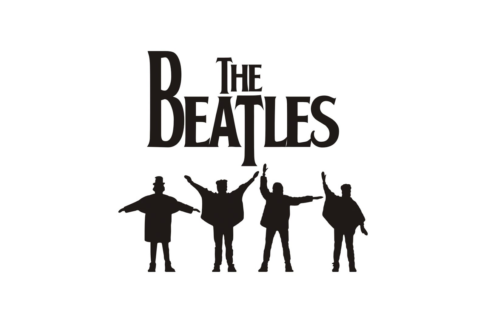

# Stego Challenge: Beatles (30 Points)

**John Lennon send a secret message to Paul McCartney about the next music tour of Beatles... Could you find the message and sumbit the flag?** 

The author of this challenge gave us 2 files, a zip and a txt file.

Let's check the content of these files.

```
$ unzip -l BAND.zip 
Archive:  BAND.zip
  Length      Date    Time    Name
---------  ---------- -----   ----
    77643  09-24-2017 19:15   BAND.JPG
---------                     -------
    77643                     1 file
```

```
$ cat m3ss\@g#_f0r_pAuL 
Url Cnhy,

Zl Sbyqre unf cnffcuenfr jvgu sbhe (4) punenpgref.

Pbhyq lbh spenpx vg sbe zr???

V fraq lbh n zrffntr sbe bhe Gbhe arkg zbagu...

Qba'g Funer vg jvgu bgure zrzoref bs bhe onaq...

-Wbua Yraaba

CF: Crnpr naq Ybir zl sevraq... Orngyrf Onaq sbe rire!
```

The ```BAND.zip``` file asks for a password to extract the ```BAND.jpg``` file while the `m3ss\@g#_f0r_pAuL` text file is encoded with Substitution Cipher.

Let's decode the content of `m3ss\@g#_f0r_pAuL` first.

```
Hey Paul,

My Folder has passphrase with four (4) characters.

Could you fcrack it for me???

I send you a message for our Tour next month...

Don't Share it with other members of our band...

-John Lennon

PS: Peace and Love my friend... Beatles Band for ever!
```

Hmm.. It is a hint to unzip the `BAND.zip` file.. The password has 4 characters and we can use `fcrackzip` command for that.

```
$ fcrackzip -u -D -p rockyou.txt BAND.zip 

PASSWORD FOUND!!!!: pw == pass
```

The 4-character password is `pass`.

Let's extract the zip file.
```
$ unzip BAND.zip 
Archive:  BAND.zip
[BAND.zip] BAND.JPG password: 
  inflating: BAND.JPG
```



Let's check the strings and binwalk for any hints.

```
$ strings BAND.JPG | awk 'length($0) > 10'
%&'()*456789:CDEFGHIJSTUVWXYZcdefghijstuvwxyz
&'()*56789:CDEFGHIJSTUVWXYZcdefghijstuvwxyz
VkhKNUlFaGhjbVJsY2lFPQ==
```

Oh, here we go again with BASE64. Let's decode that one.

```
$ echo 'VkhKNUlFaGhjbVJsY2lFPQ==' | base64 --decode | base64 --decode
Try Harder!
```

Oh Fudge! Okay :/

```
$ binwalk BAND.JPG 

DECIMAL       HEXADECIMAL     DESCRIPTION
--------------------------------------------------------------------------------
0             0x0             JPEG image data, JFIF standard 1.01
```

And I tried stegsolve, and other steganography tools but nothing interesting and got stuck with this challenge. No clues at all.

So I tried steghide but I need a password, so what I did is try everything related to Beatles.

I tried `Beatles`, `John`, `John Lennon`, `Paul`, `Paul McCartney`, `The Beatles`, then I tried `THEBEATLES` after staring in the image for fcking few minutes.

```
$ steghide extract -sf BAND.JPG -p THEBEATLES
wrote extracted data to "testabeatle.out".
```

Okay, we got another file to check and it's a binary file.

```
$ file testabeatle.out 
testabeatle.out: ELF 64-bit LSB shared object, x86-64, version 1 (SYSV), dynamically linked, interpreter /lib64/ld-linux-x86-64.so.2, for GNU/Linux 2.6.32, BuildID[sha1]=ca68ea305ff7d393662ef8ce4e5eed0b478c8b4e, not stripped
```

Oh boy! I'm dead.

Wait.. let's use strings first maybe there is something hidden in the file.

```
# strings testabeatle.out | awk 'length($0) > 20'
/lib64/ld-linux-x86-64.so.2
_ITM_deregisterTMCloneTable
_ITM_registerTMCloneTable
Hey Paul! If you are here... Give my your favourite character!
Ok Paul... A little challenge for you mate, cause last month someone crazy man hacked...WTF! Let's Begin!
########################################Challenge############################################################
Tell me PAul! The result of  5+5?
Ok!ok! it was easy... Tell me now... The result of: 5+5-5*(5/5)?
Last one! The result of: (2.5*16.8+1.25*10.2+40*0.65+1.5*7.5+1.25*3.2):40
Hey Paul! nice!!! this is  the message
VGhlIHRvdXIgd2FzIGNhbmNlbGVkIGZvciB0aGUgZm9sbG93aW5nIG1vbnRoLi4uIQ0KDQpJJ2xsIGdvIG91dCBmb3IgZGlubmVyIHdpdGggbXkgZ2lybGZyaWVuZCBuYW1lZCBZb2NvISA7KQ0KDQpIVEJ7UzByUnlfTXlfRlIxM25EfQ0K
WTF! You are not Paul!! SOS SOS SOS HACKER HERE!! I will call the police someone want to steal my data!!!
########################################END OF CHALLENGE############################################################
GCC: (Debian 7.2.0-5) 7.2.0
__do_global_dtors_aux
__do_global_dtors_aux_fini_array_entry
__frame_dummy_init_array_entry
_GLOBAL_OFFSET_TABLE_
_ITM_deregisterTMCloneTable
__libc_start_main@@GLIBC_2.2.5
__isoc99_scanf@@GLIBC_2.7
_ITM_registerTMCloneTable
__cxa_finalize@@GLIBC_2.2.5
```

See, strings can do the work! We found a BASE64 here.

```
$ echo "VGhlIHRvdXIgd2FzIGNhbmNlbGVkIGZvciB0aGUgZm9sbG93aW5nIG1vbnRoLi4uIQ0KDQpJJ2xsIGdvIG91dCBmb3IgZGlubmVyIHdpdGggbXkgZ2lybGZyaWVuZCBuYW1lZCBZb2NvISA7KQ0KDQpIVEJ7UzByUnlfTXlfRlIxM25EfQ0K" | base64 --decode
The tour was canceled for the following month...!

I'll go out for dinner with my girlfriend named Yoco! ;)

HTB{S0rRy_My_FR13nD}
```

We finally got the flag!

By the way, I tried to run the binary file too and it's easy to solve lol.

```
$ ./testabeatle.out 
Hey Paul! If you are here... Give my your favourite character!

Ok Paul... A little challenge for you mate, cause last month someone crazy man hacked...WTF! Let's Begin!
########################################Challenge############################################################
Tell me PAul! The result of  5+5?
10
Ok!ok! it was easy... Tell me now... The result of: 5+5-5*(5/5)?
5
Last one! The result of: (2.5*16.8+1.25*10.2+40*0.65+1.5*7.5+1.25*3.2):40
2.4
Hey Paul! nice!!! this is  the message
VGhlIHRvdXIgd2FzIGNhbmNlbGVkIGZvciB0aGUgZm9sbG93aW5nIG1vbnRoLi4uIQ0KDQpJJ2xsIGdvIG91dCBmb3IgZGlubmVyIHdpdGggbXkgZ2lybGZyaWVuZCBuYW1lZCBZb2NvISA7KQ0KDQpIVEJ7UzByUnlfTXlfRlIxM25EfQ0K
########################################END OF CHALLENGE############################################################
```
