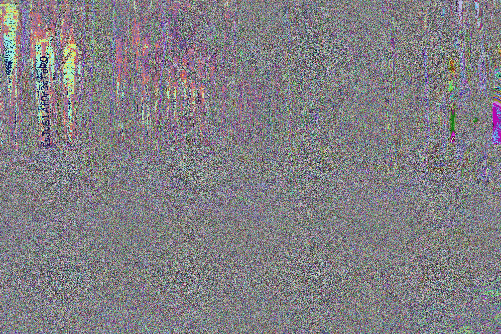

# Stego Challenge: Forest (40 Points)

**Explore the forest and capture the flag!**


Let's check the image using `binwalk` and `strings` command first.

```
$ binwalk forest.jpg 

DECIMAL       HEXADECIMAL     DESCRIPTION
--------------------------------------------------------------------------------
0             0x0             JPEG image data, JFIF standard 1.01
```

```
$ strings forest.jpg | awk 'length($0) > 10'
%&'()*456789:CDEFGHIJSTUVWXYZcdefghijstuvwxyz
&'()*56789:CDEFGHIJSTUVWXYZcdefghijstuvwxyz
e5/.U).mRMh
hd\.WyRPt9#
U_4S?#~.kpx
Wg^Erc(J9d(
ZZ<30I"XB2VR
(YLS,Bb\)TG
nmc?<W"[9LR
#u+N*IJ-J-_g
[GXuy|AkjV(DZ
@mNhYR[=#JX
6'p}_Wwy\/b
GBw{~59.q_)
7+0r}3^-]5~W"KT
%UQ*Pm9)E%9
\!,-<>i?g?z*m{
Fv}3]v?2Eqj%12
7nozQ}T[W_-
<Fg`CGs$I:H
VEl.X.r1_!R
V^$]:7v0\C,
I.:G$rm1H~W
8U)(Oe(8^5.
yZ9Vc</2t+/k
EBQsJRM/=S]
]Giky#G$Vop
;u^ds>g},sGK
3X{(s=#]'*S_
!-q,!KnH`RI^
{d^DXne\G#m
9;J-smu$q,3
mm<3e#[\j96
]]Gme#HU.o
```

Uhmm.. Nothing interesting here.

Let's try stegsolve and use different bit planes..

Oh look, I found something interesting with Random Colour Map Plane.



```IsJuS1Af0r3sTbR0```

Maybe we can use this on steghide as a password and extract a file? Let's try!

```
$ steghide extract -sf forest.jpg -p IsJuS1Af0r3sTbR0
wrote extracted data to "nothinghere.txt".
```

And we got something from steghide!

```
$ cat nothinghere.txt 
Gur sberfg vf n pbzcyrk rpbflfgrz pbafvfgvat znvayl bs gerrf gung ohssre gur rnegu naq fhccbeg n zlevnq bs yvsr sbezf. Gur gerrf uryc perngr n fcrpvny raivebazrag juvpu, va ghea, nssrpgf gur xvaqf bs navznyf naq cynagf gung pna rkvfg va gur sberfg. Gerrf ner na vzcbegnag pbzcbarag bs gur raivebazrag. Gurl pyrna gur nve, pbby vg ba ubg qnlf, pbafreir urng ng avtug, naq npg nf rkpryyrag fbhaq nofbeoref. UGO{NzNm1aTfXvyYmMOe0}
```

Ohh, a Substition Cipher.. How? I noticed repeating words in the ciphertext.. `Gur = The` and `UGO = HTB`.

Decoding the ciphertext will gives us this message:
```
The forest is a complex ecosystem consisting mainly of trees that buffer the earth and support a myriad of life forms. The trees help create a special environment which, in turn, affects the kinds of animals and plants that can exist in the forest. Trees are an important component of the environment. They clean the air, cool it on hot days, conserve heat at night, and act as excellent sound absorbers. HTB{AmAz1nGsKilLzZBr0}
```
