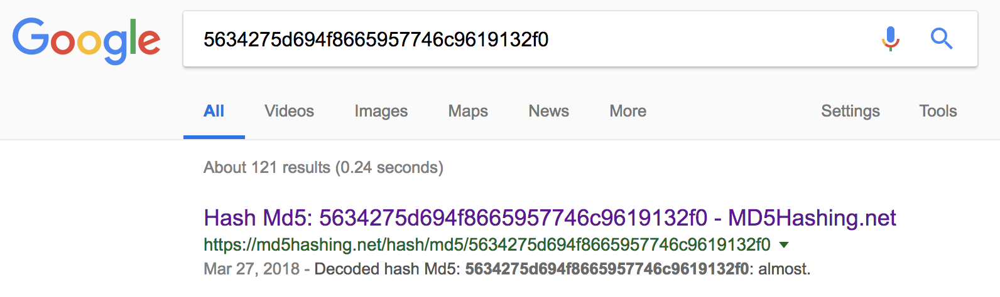

# Stego Challenge: Hackerman (30 Points)

**There should be something hidden inside this photo... Can you find out?**


Keyword: "something hidden inside this photo"

Let's use binwalk to check if there's a file inside this photo.

```
$ binwalk hackerman.jpg 

DECIMAL       HEXADECIMAL     DESCRIPTION
--------------------------------------------------------------------------------
0             0x0             JPEG image data, JFIF standard 1.01
```

Uhmm.. Fudge! Let's check the content using `strings` command and see if there's something inside.

```
$ strings hackerman.jpg | awk 'length($0) > 10'
%&'()*456789:CDEFGHIJSTUVWXYZcdefghijstuvwxyz
&'()*56789:CDEFGHIJSTUVWXYZcdefghijstuvwxyz
5634275d694f8665957746c9619132f0
```

Hmmm.. What is this: `5634275d694f8665957746c9619132f0`?

Let's ask Google:



Oh, wow! It's MD5 and `almost` is the equivalent value.

Okay, we got a word and it could be a password to extract a file/data from the image.

Well, we can use steghide for that.

```
$ steghide extract -sf  hackerman.jpg -p almost
wrote extracted data to "hackerman.txt".
```

Woohoo! Let's cat the content of the txt file.

```
$ cat hackerman.txt 
SFRCezN2MWxfYzBycH0=
```

Ohh, Base64.. Let's decode it..

```
$ cat hackerman.txt | base64 --decode
HTB{3v1l_c0rp}
```

Yey!
