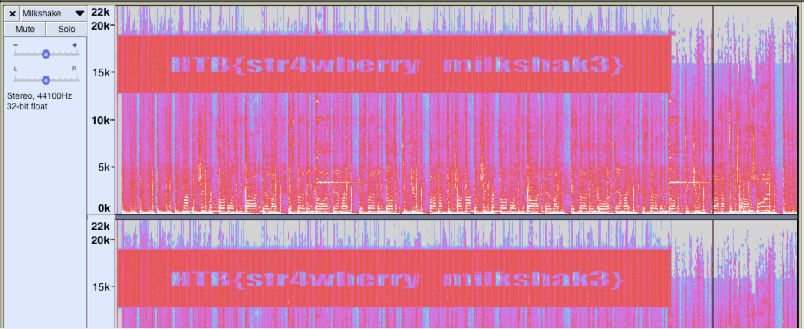

# Stego Challenge: Milkshake (10 Points)

**Can you bring all the boys to the yard?**

The author of this challenge gave us an MP3 file.

```
$ file Milkshake.mp3 
Milkshake.mp3: Audio file with ID3 version 2.4.0, extended header, contains:MPEG ADTS, layer III, v1, 128 kbps, 44.1 kHz, JntStereo
```

I played the mp3 file and there's a sound that irritates my ear. I guess there might be something inside the mp3 file, maybe a text? that creates an irritating sound when played.

Let's use Audacity and use Spectogram to validated our suspicion.



Oh, yeah! The author loves strawberry milkshake.
