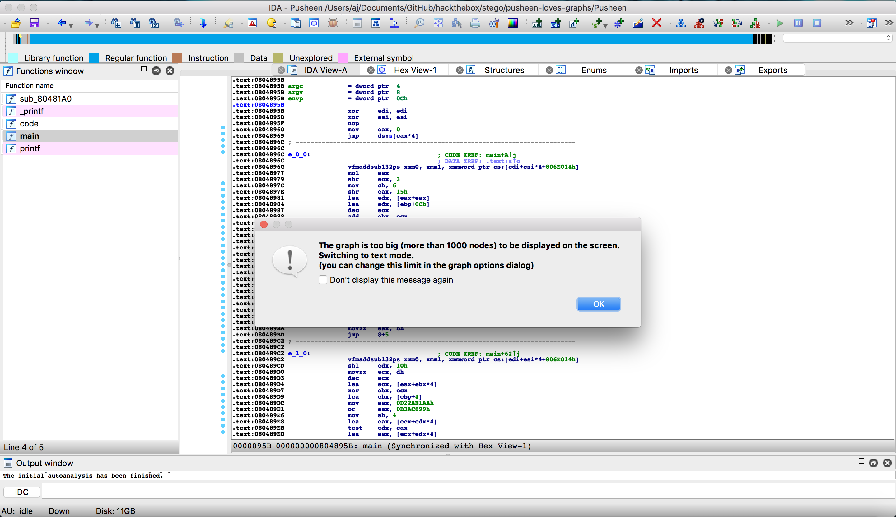
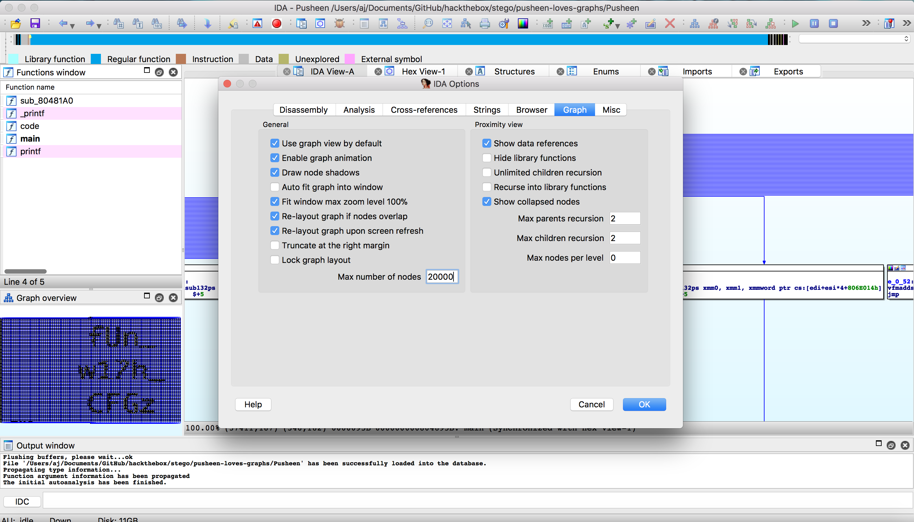
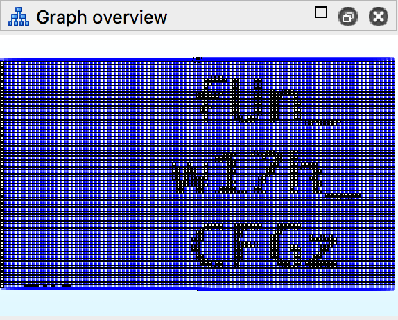

# Stego Challenge: Pusheen Loves Graphs (30 Points)

**Pusheen just loves graphs, Graphs and IDA. Did you know cats are weirdly controlling about their reverse engineering tools? Pusheen just won't use anything except IDA.**

Let's use `file` command first.

```
$ file Pusheen 
Pusheen: ELF 32-bit LSB executable, Intel 80386, version 1 (SYSV), dynamically linked, interpreter /lib/ld-linux.so.2, not stripped
```

Okay, an executable file.

Let's check it with `strings`.

```
$ strings Pusheen | awk 'length($0) > 10'
/lib/ld-linux.so.2
             
repsych.asm
_GLOBAL_OFFSET_TABLE_
printf@@GLIBC_2.0
__bss_start
.gnu.version
.gnu.version_r
```

Okay.. Let's run the file.

```
$ ./Pusheen 
   ▐▀▄      ▄▀▌   ▄▄▄▄▄▄▄             
   ▌▒▒▀▄▄▄▄▀▒▒▐▄▀▀▒██▒██▒▀▀▄          
  ▐▒▒▒▒▒▒▒▒▒▒▒▒▒▒▒▒▒▒▒▒▒▒▒▒▒▀▄        
  ▌▒▒▒▒▒▒▒▒▒▒▒▒▒▄▒▒▒▒▒▒▒▒▒▒▒▒▒▀▄      
▀█▒▒█▌▒▒█▒▒▐█▒▒▀▒▒▒▒▒▒▒▒▒▒▒▒▒▒▒▒▌     
▀▌▒▒▒▒▒▀▒▀▒▒▒▒▒▀▀▒▒▒▒▒▒▒▒▒▒▒▒▒▒▒▐   ▄▄
▐▒▒▒▒▒▒▒▒▒▒▒▒▒▒▒▒▒▒▒▒▒▒▒▒▒▒▒▒▒▒▒▒▌▄█▒█
▐▒▒▒▒▒▒▒▒▒▒▒▒▒▒▒▒▒▒▒▒▒▒▒▒▒▒▒▒▒▒▒▒▐▒█▀ 
▐▒▒▒▒▒▒▒▒▒▒▒▒▒▒▒▒▒▒▒▒▒▒▒▒▒▒▒▒▒▒▒▒▐▀   
▐▒▒▒▒▒▒▒▒▒▒▒▒▒▒▒▒▒▒▒▒▒▒▒▒▒▒▒▒▒▒▒▒▌    
 ▌▒▒▒▒▒▒▒▒▒▒▒▒▒▒▒▒▒▒▒▒▒▒▒▒▒▒▒▒▒▒▐     
 ▐▒▒▒▒▒▒▒▒▒▒▒▒▒▒▒▒▒▒▒▒▒▒▒▒▒▒▒▒▒▒▌     
  ▌▒▒▒▒▒▒▒▒▒▒▒▒▒▒▒▒▒▒▒▒▒▒▒▒▒▒▒▒▐      
  ▐▄▒▒▒▒▒▒▒▒▒▒▒▒▒▒▒▒▒▒▒▒▒▒▒▒▒▒▄▌      
    ▀▄▄▀▀▀▀▄▄▀▀▀▀▀▀▄▄▀▀▀▀▀▀▄▄▀       
 
```

Okay, that's cute but let's go back to solving.. Let's try to open the file with IDA.

```
IDA or The Interactive Disassembler is a disassembler for computer software which generates assembly language source code from machine-executable code. It supports a variety of executable formats for different processors and operating systems.
```

Right after we opened the file with IDA, something pop up in the screen.



We need to change the limit of nodes to properly view the graph.

So to do this, Go to `Options > General > Graph` then change nodes from 1000 to 10000 or higher.



The graph is now dispalyed on the screen and the flag is found.


