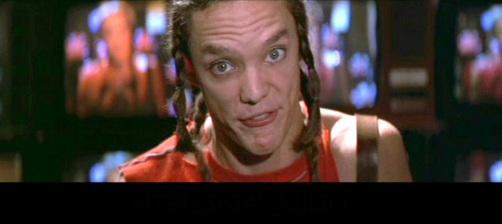
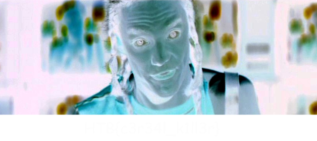
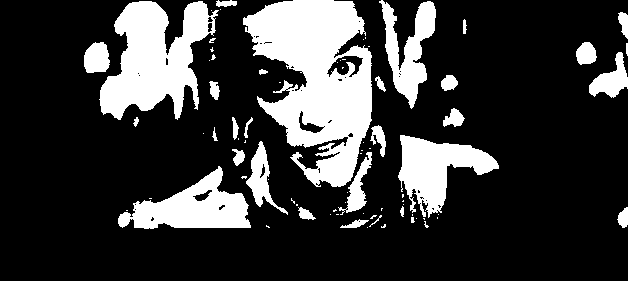
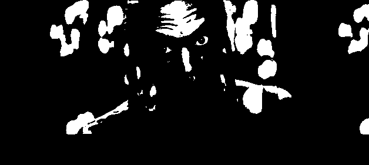

# Stego Challenge: Widescreen (20 Points)

**Someone has leaked pictures of our unreleased movie. Can you help identify him?**



First, let's check the PNG image using binwalk and see if there are any files hidden in the image.

```
$ binwalk widescreen.png 

DECIMAL       HEXADECIMAL     DESCRIPTION
--------------------------------------------------------------------------------
0             0x0             PNG image, 628 x 281, 8-bit/color RGB, non-interlaced
85            0x55            Zlib compressed data, best compression
2757          0xAC5           Zlib compressed data, best compression
```

Let's try to check the content using strings..

```
$ strings widescreen.png | awk 'length($0) > 10'
OiCCPPhotoshop ICC profile
L&H$'3KS}V9%
B&qTMfu*<Qq
7;<hiqXb]=:
0111111111111111111111111111111111111111111111111111111111111111111111111111111111111111111111
```

There is nothing interesting in binwalk and strings..

Wait, what is that black rectangle in the bottom part of the image? Hmm.. Let's try stegsolve.

Stegsolve is a stegano solver for challenges. One of its main functions is a quick view of different bit planes and some simple transformations.

**Colour Inversion (XOR)**


Oh, God! That's creepy!

**Red Plane**


Okay.

**Green Plane**


Okay..

**Blue Plane**


Okay...

**Random Colour Map**


Finally!
