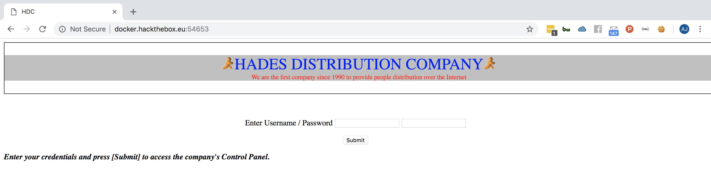
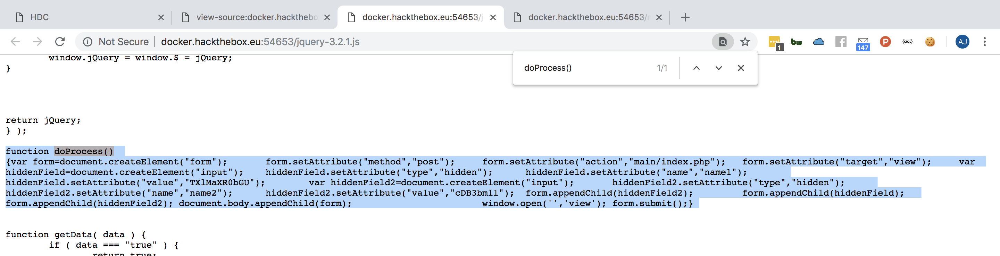
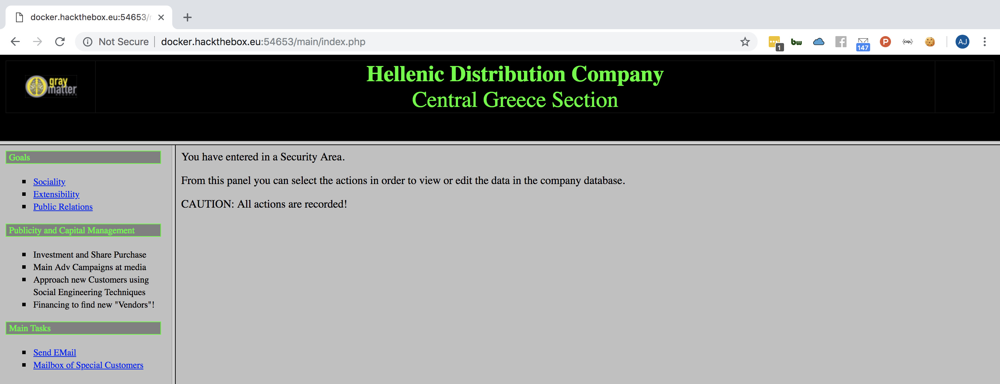
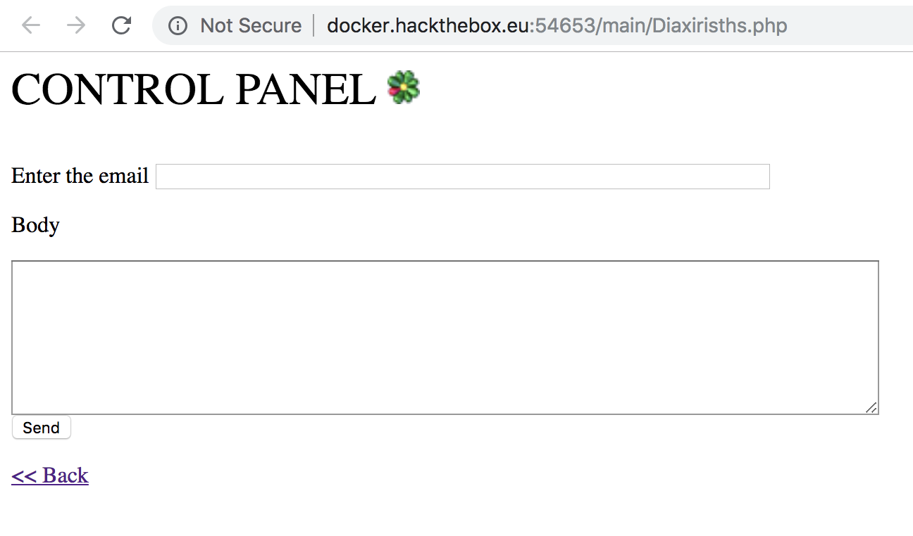
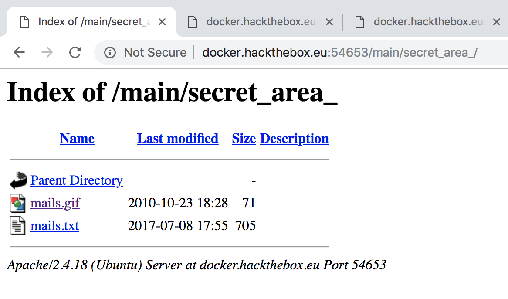
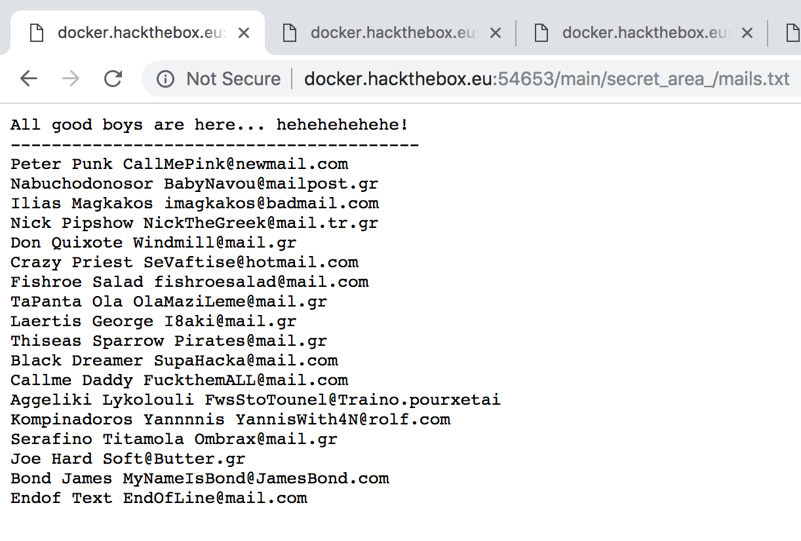
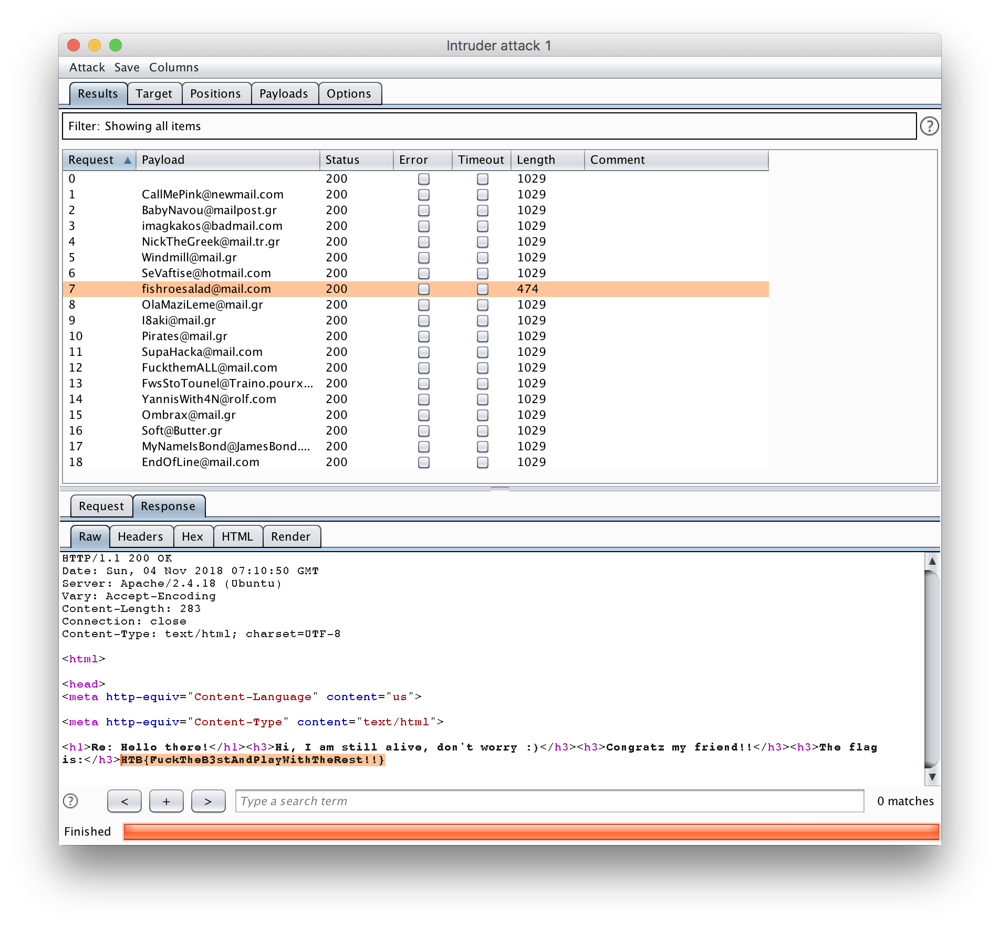

# Web Challenge: HDC (30 Points)

**We believe a certain individual uses this website for shady business. Can you find out who that is and send him an email to check, using the web site's functionality?**
<br>**Note: The flag is not an e-mail address.**

```
Host: docker.hackthebox.eu
Port: 54653
```

A simple login page will greet us when accessing the website.



Based on challenge description, we need to know who uses this website for shady business and the author of this challenge wants us to send him an email. So thr first thing we need to do is to login on this website and access the email functionality.

Let's check and review the source code of this website.

There are two javascripts: [jquery-3.2.1.js](http://docker.hackthebox.eu:54653/jquery-3.2.1.js) and [myscripts.js](http://docker.hackthebox.eu:54653/myscripts.js).

Here is the source code for the login form:

```HTML
<form id='formaki' name='formaki' action="./main/index.php" method="post">
  <p align="center">Enter Username / Password
    <input type="text" name="name1" size="20">
    <input type="text" Name="name2" size="20">
  </p>

  <p align="center">
    <input type="hidden" value= name="name1">
    <input type="hidden" value= name="name2">
    <input type="button" value="Submit" onclick="doProcess()"/>
  </p>
</form>
```

Using those javascripts, we will find anything related to: <br>
`formaki` - id and name of the form <br>
`doProcess()` - javascript event of the form <br>
`name1` & `name2` - name fields on the form <br>

Accessing `myscripts.js` file will give us this source code:

```javascript
function doProcess()
{
	document.forms["formaki"].submit();
}
```

Accessing `jquery-3.2.1.js` file will give us bunch of functions with tens of lines of codes, but searching for `formaki`, `doProcess()`, and `name1 & name2` will help us find what we really need to look for.



Finally! We found something that will help us access the website. Let me get that code and paste it here.

```javascript
function doProcess() {
    var form = document.createElement("form");
    form.setAttribute("method", "post");
    form.setAttribute("action", "main/index.php");
    form.setAttribute("target", "view");
    var hiddenField = document.createElement("input");
    hiddenField.setAttribute("type", "hidden");
    hiddenField.setAttribute("name", "name1");
    hiddenField.setAttribute("value", "TXlMaXR0bGU");
    var hiddenField2 = document.createElement("input");
    hiddenField2.setAttribute("type", "hidden");
    hiddenField2.setAttribute("name", "name2");
    hiddenField2.setAttribute("value", "cDB3bmll");
    form.appendChild(hiddenField2);
    form.appendChild(hiddenField);
    form.appendChild(hiddenField2);
    document.body.appendChild(form);
    window.open('', 'view');
    form.submit();
}
```

Ohh.. This function will really do the process haha. It contains the value of `name1` and value of `name 2`.

```
name1 = TXlMaXR0bGU (This is the username).
name2 = cDB3bmll (This is the password).
```

Using those information we've discovered, we can now access the website.



Here is the page where we will send the email.



Next thing we need to do is to test this email functionality, so I tried entering email and message but ends up nothing.

I guess we need to find a valid email address mainly because we need to send him an email. 

So, I fired up Burp and opened all hyperlinks and pages to check if there is something interesting with HTTP request and HTTP response then I found something on this page, `mails.php`.

```html
HTTP/1.1 200 OK
Date: Sun, 04 Nov 2018 06:22:23 GMT
Server: Apache/2.4.18 (Ubuntu)
Vary: Accept-Encoding
Content-Length: 802
Connection: close
Content-Type: text/html; charset=UTF-8

<html>
<meta http-equiv="Content-Type" content="text/html; charset=windows-1253">
<meta http-equiv="Content-Language" content="us">
<meta name="ProgId" content="FrontPage.Editor.Document">

<font size="6"><span lang="en-us">Special Customers' Mailbox</font><b><font size="6">&nbsp;&nbsp;&nbsp; </font></b><body>
</body><hr><p><body>
</p>
<p>Up to now we have 5 special customers who will help us to achieve our goals.<br>
<br>
This list will soon be expanded with the new 'expansion program' for our corporate goals.<br>
<br>
It is planned that within the next six months we will have reached 20 dedicated Special Customers.<br>
</p>
<p><span lang="us"><a href="main.htm">ÅðéóôñïöÞ</a></span></p>
</body>

</html>
```

Did you see it? No?

Okay, check this line..
```html

```

Wee!

Let's check that directory and see if something is there.



Holy Moly! A `mails.txt` file?



Okay.. Using Burp's Intruder we will automate the process of sending email..



Gotcha!
